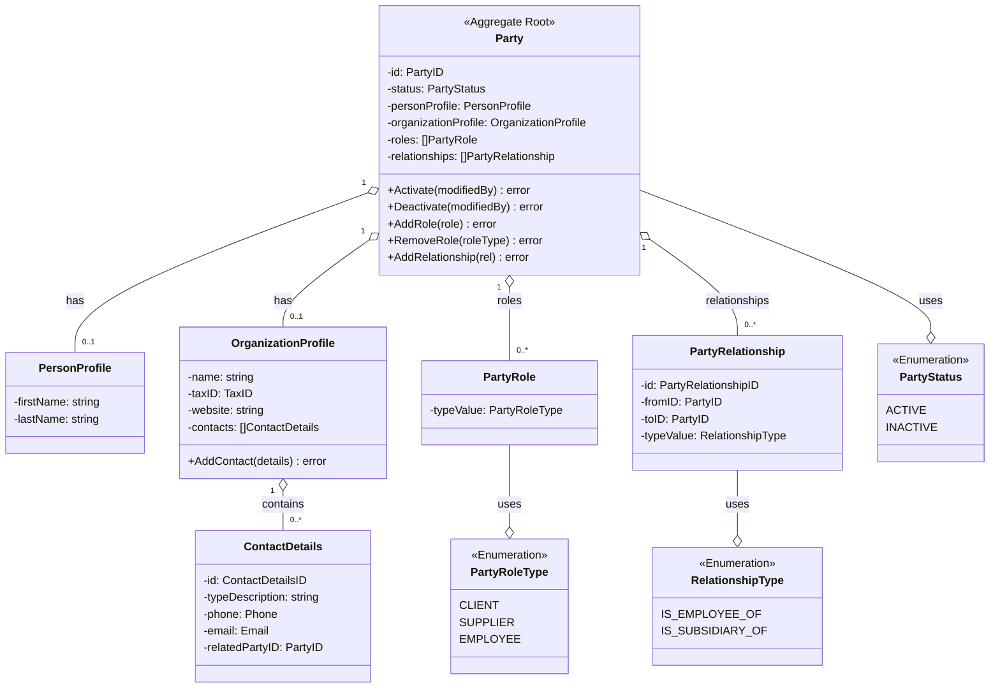

# Diagrama de Dominio - Módulo Party

**Versión:** 1.0
**Fecha:** 2026-02-03
**Propósito:** Visualizar las entidades, value objects y sus relaciones dentro del Bounded Context de Party, alineado con ADR-012 y la implementación actual.

---

## Diagrama de Clases (UML)

El agregado principal es `Party`, que puede contener un perfil de persona, de organización o ambos. Además gestiona roles, relaciones y contactos de organización.

---

## Descripción del Modelo

1. **Party (Raíz del Agregado):** Entidad central que representa una persona, una organización o ambas. Garantiza la consistencia de perfiles, roles y relaciones.
2. **PersonProfile:** Datos personales básicos (nombre y apellidos).
3. **OrganizationProfile:** Datos corporativos básicos y contactos asociados.
4. **ContactDetails:** Detalle de contacto con email/teléfono, opcionalmente vinculado a otra Party.
5. **Roles y Relaciones:** Modelan el rol que cumple la Party y sus vínculos con otras Parties.

### Relaciones Clave
- Un `Party` puede tener 0 o 1 `PersonProfile` y 0 o 1 `OrganizationProfile`.
- Un `OrganizationProfile` puede tener múltiples `ContactDetails`.
- Un `Party` puede tener múltiples roles y relaciones tipadas.
