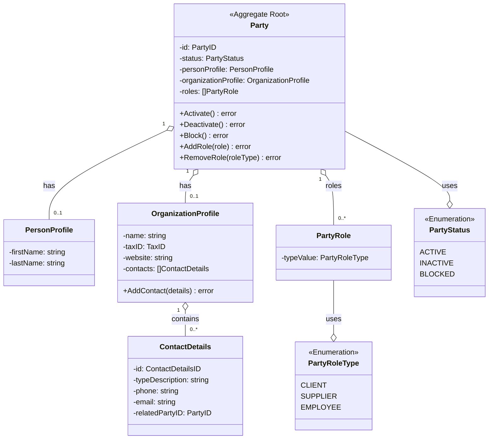

# Diagrama de Dominio - Módulo Party

**Versión:** 1.0
**Fecha:** 2026-02-03
**Propósito:** Visualizar las entidades, value objects y sus relaciones dentro del Bounded Context de Party, alineado con ADR-012 y la implementación actual.

---

## Diagrama de Clases (UML)

El agregado principal es `Party`, que puede contener un perfil de persona, de organización o ambos. Además gestiona roles, relaciones y contactos de organización.

---

## Descripción del Modelo

1. **Party (Raíz del Agregado):** Entidad central que representa una persona, una organización o ambas. Garantiza la consistencia de perfiles y roles.
2. **PersonProfile:** Datos personales básicos (nombre y apellidos).
3. **OrganizationProfile:** Datos corporativos básicos y contactos asociados.
4. **ContactDetails:** Detalle de contacto con email/teléfono (tipos string básicos), opcionalmente vinculado a otra Party.
5. **Roles:** Modelan el rol que cumple la Party en el sistema.

*Nota: Las **Relaciones** entre Parties y las **Direcciones** se gestionan como servicios de aplicación sobre persistencia relacional, por lo que no figuran como entidades ricas en este diagrama de dominio.*
