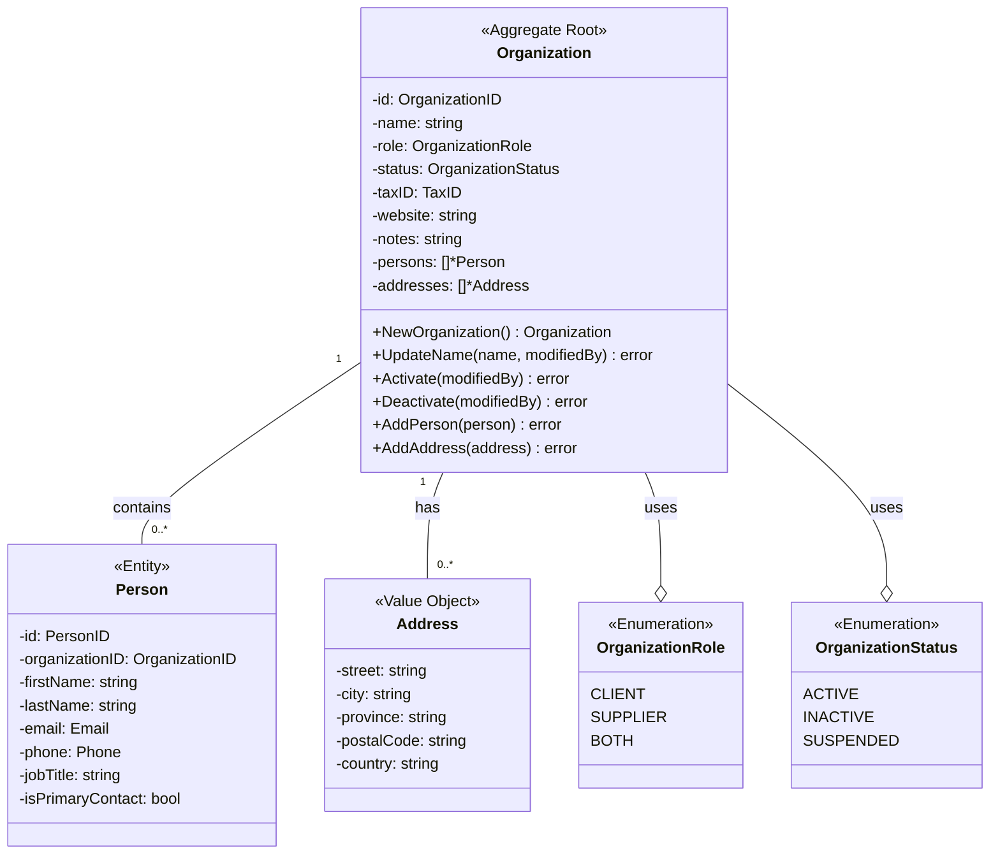

# Diagrama de Dominio - Módulo Party

**Versión:** 2.0
**Fecha:** 2026-02-01
**Autor:** Gemini
**Propósito:** Visualizar las entidades, value objects y sus relaciones dentro del Bounded Context de "Party", de acuerdo con la implementación actual.

---

## Diagrama de Clases (UML)

Este diagrama muestra las clases principales del dominio `Party` y cómo se relacionan. El modelo se centra en el agregado `Organization`, que gestiona las entidades `Person` y los value objects `Address`.

---

## Descripción del Modelo

1.  **Organization (Raíz del Agregado):** Es la entidad central que representa a un cliente, un proveedor o ambos. Como raíz del agregado, gestiona el ciclo de vida y la consistencia de las entidades `Person` y los value objects `Address` que le pertenecen.

2.  **Person (Entidad):** Representa a una persona de contacto dentro de una `Organization`. Es una entidad porque tiene una identidad única (`PersonID`) y su ciclo de vida está ligado al de la `Organization`.

3.  **Address (Value Object):** Representa una dirección física. Se modela como un `Value Object` porque carece de identidad propia y se define por el valor de sus atributos. Dos direcciones son iguales si todos sus campos son idénticos.

4.  **OrganizationRole (Enumeración):** Define el rol que desempeña una organización en el sistema (Cliente, Proveedor, o Ambos).

5.  **OrganizationStatus (Enumeración):** Define el estado actual de una organización (Activo, Inactivo, etc.).

### Relaciones Clave:
-   Una **Organization** contiene cero o más entidades **Person**. La `Organization` es responsable de añadir o eliminar personas.
-   Una **Organization** tiene cero o más `Value Objects` **Address**.
-   La consistencia del agregado se mantiene a través de los métodos de la `Organization` (ej. `AddPerson`, `AddAddress`).
