# Diagrama de Dominio - Módulo Pricing

## 1. Diagrama de Clases (UML)

```mermaid
classDiagram
    direction TB
    
    class PricingRule {
        +ID: UUID
        +Nombre: string
        +Descripción: string
        +Tipo: Enum (margen, descuento, fijo)
        +Condiciones: string (producto, categoría, fecha)
        +Valor: Percentage | Money
        +Prioridad: int
        +Evaluar(contextoDeCalculo): bool
    }

    class ClientPricing {
        +ID: UUID
        +ID_Cliente: PartyID
        +ID_PricingRule: PricingRuleID
        +ValorEspecífico: Money (opcional)
        +ObtenerReglasAplicables(cliente): List<PricingRule>
    }

    class BrandProfitMargin {
        +ID: UUID
        +ID_Marca: BrandID
        +PorcentajeBeneficio: Percentage
        +CantidadFijaBeneficio: Money
        +FechaInicio: DateTime
        +FechaFin: DateTime
        +ObtenerMargen(marca, fecha): Percentage | Money
    }

    class SalesDiscountRule {
        +ID: UUID
        +Nombre: string
        +Descripción: string
        +Tipo: Enum (porcentaje, cantidad fija)
        +Condiciones: string (mínimo de compra, ID_Cliente, ID_Producto)
        +Valor: Percentage | Money
        +Prioridad: int
        +Aplicar(contextoDeVenta): Money | Percentage
    }

    class PriceCalculation {
        +ID: UUID
        +ID_Producto_Variante: ProductVariantID
        +ID_Cliente: PartyID
        +PrecioBase: Money
        +ModificadoresAplicados: List<string>
        +MargenBeneficioAplicado: Percentage | Money
        +PrecioVentaCalculado: Money
        +DescuentosAplicados: List<SalesDiscount>
        +PrecioFinal: Money
        +FechaCalculo: DateTime
        +ID_Usuario: UserID
        +Guardar(): void
    }

    class Money {
        +Cantidad: decimal
        +Moneda: string
        +Sumar(Money): Money
        +Restar(Money): Money
        +Multiplicar(decimal): Money
        +Dividir(decimal): Money
    }

    class Percentage {
        +Valor: float
        +AplicarA(cantidad): decimal
    }

    class Brand {
        +ID_Marca: BrandID
        +Nombre: string
    }

    class ProductCode {
        +Código: string
    }

    class VariantCode {
        +Código: string
    }

    class SellingPriceCalculatorService {
        +CalcularPrecioVenta(producto, variante, marca, contexto): Money
    }

    class SalesDiscountCalculatorService {
        +AplicarDescuentos(precioVenta, cliente, cantidadTotalVenta, productosEnVenta, contexto): Money
    }

    PricingRule --o Money
    PricingRule --o Percentage
    ClientPricing --o PricingRuleID
    ClientPricing --o PartyID
    ClientPricing --o Money
    BrandProfitMargin --o BrandID
    BrandProfitMargin --o Percentage
    BrandProfitMargin --o Money
    SalesDiscountRule --o PartyID
    SalesDiscountRule --o ProductID
    SalesDiscountRule --o Percentage
    SalesDiscountRule --o Money
    PriceCalculation --o ProductVariantID
    PriceCalculation --o PartyID
    PriceCalculation --o Money
    PriceCalculation --o UserID
    
    SellingPriceCalculatorService ..> PricingRule : uses
    SellingPriceCalculatorService ..> BrandProfitMargin : uses
    SellingPriceCalculatorService ..> ProductCode : uses
    SellingPriceCalculatorService ..> VariantCode : uses
    SellingPriceCalculatorService ..> Money : returns
    SellingPriceCalculatorService ..> Percentage : uses
    
    SalesDiscountCalculatorService ..> SalesDiscountRule : uses
    SalesDiscountCalculatorService ..> ClientPricing : uses
    SalesDiscountCalculatorService ..> Money : returns
    SalesDiscountCalculatorService ..> Percentage : uses

    PricingRule : ID_Cliente (referencia Party)
    ClientPricing : ID_Cliente (referencia Party)
    BrandProfitMargin : ID_Marca (referencia Product)
    SalesDiscountRule : ID_Cliente (referencia Party), ID_Producto (referencia Product)
    PriceCalculation : ID_Producto/Variante (referencia Product), ID_Cliente (referencia Party), ID_Usuario (referencia IAM)

```

## 2. Descripción

Este diagrama visualiza las entidades, Value Objects y Servicios de Dominio que componen el módulo de Precios, así como sus relaciones clave. Refleja la información detallada en `pricing-domain.md` y las decisiones arquitectónicas de `ADR-016`.
