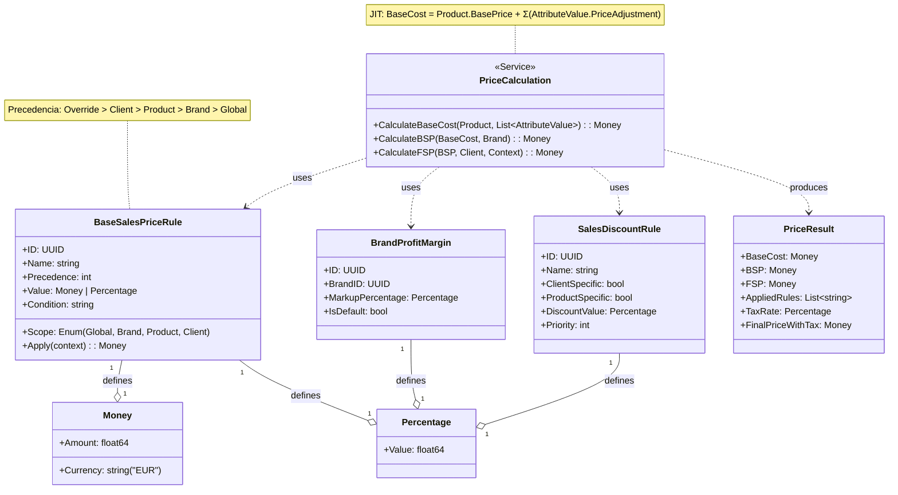

# Diagrama de Dominio - Módulo Pricing

## 1. Diagrama de Clases (UML)

## 2. Descripción y Jerarquía de Reglas

Este diagrama visualiza las entidades y el flujo de cálculo del motor de precios de TramaTex.

### Jerarquía de Precedencia
El motor de Pricing aplica las reglas en el siguiente orden de especificidad, donde la primera regla que coincide detiene la búsqueda para ese nivel:
1.  **Override (Manual):** Precio fijado explícitamente para una operación.
2.  **Cliente Específico:** Acuerdo de precios con una `Party` concreta.
3.  **Producto Específico:** Precio base definido para un `Product` o `ProductVariant`.
4.  **Marca:** Margen de beneficio por defecto de la `Brand`.
5.  **Global:** Regla por defecto del sistema.

### Conceptos de Cálculo
*   **BaseCost (JIT):** Calculado dinámicamente sumando el `BasePrice` del producto y los modificadores de los atributos seleccionados.
*   **BSP (Base Selling Price):** `BaseCost` aplicado el margen comercial (`BrandProfitMargin`).
*   **FSP (Final Selling Price):** `BSP` tras aplicar descuentos de cliente o promociones (`SalesDiscountRule`).
