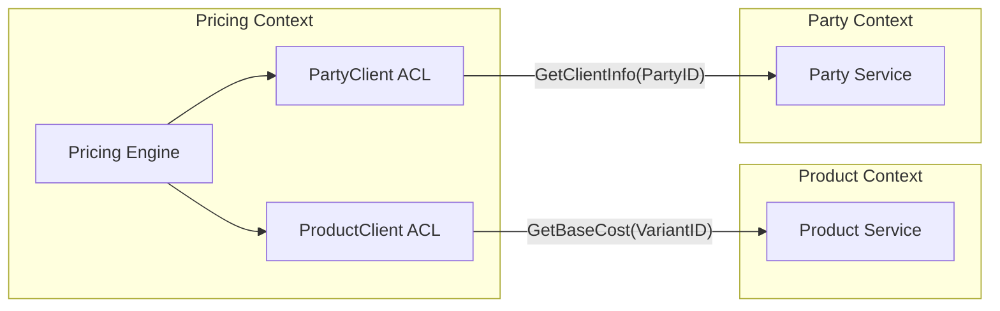
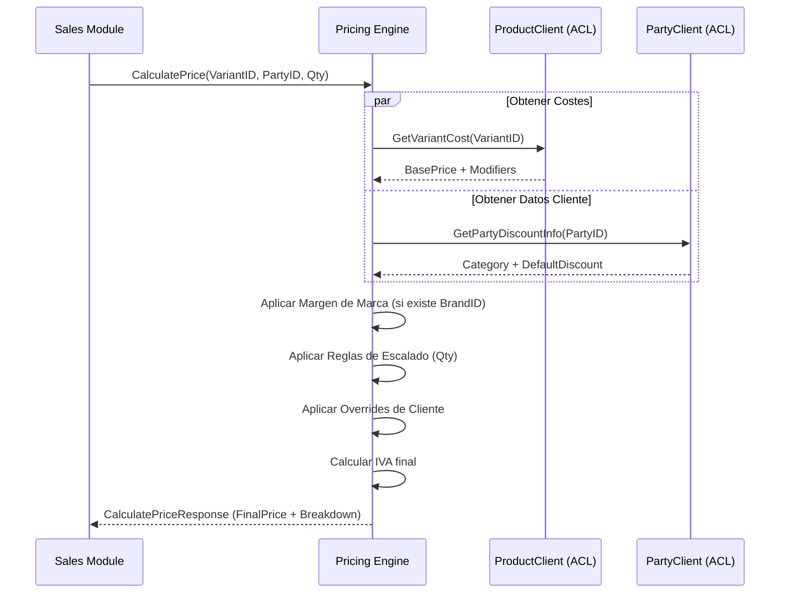

# Integración entre Módulos (Flujo Económico)

Este documento detalla cómo interactúa el módulo de **Pricing** con **Product** y **Party** para realizar cálculos de precios, garantizando el desacoplamiento mediante el patrón *Anti-Corruption Layer* (ACL).

---

## 1. Arquitectura de Comunicación

El módulo de Pricing no accede directamente a las bases de datos de otros módulos. En su lugar, utiliza "Infrastructure Clients" que actúan como adaptadores:

- **`ProductClient`**: Adaptador en `pricing/infrastructure/productclient` que consume la capa de aplicación de Product.
- **`PartyClient`**: Adaptador en `pricing/infrastructure/partyclient` que consume la capa de aplicación de Party.

---

## 2. Flujo de Datos para Cálculo de Precio

Para realizar un cálculo de precio final (`UC-PRI-001`), el motor sigue este orden de recolección de datos:

| Origen | Datos Requeridos | Uso en Pricing |
| :--- | :--- | :--- |
| **Product** | BasePrice (Producto) | Punto de partida del coste. |
| **Product** | Attribute Modifiers (Variante) | Ajustes por talla, color, etc. |
| **Product** | TaxRate (IVA) | Aplicación final de impuestos. |
| **Party** | Category / Roles | Selección de PricingRule aplicable. |
| **Party** | DefaultDiscountPercentage | Descuento fallback si no hay reglas. |

---

## 3. Diagrama de Secuencia: Cálculo de Precio

---

## 4. Estrategia de Resiliencia

- **Fallback de Descuento:** Si el `PartyClient` no puede contactar con el módulo Party, el motor de precios aplica un descuento de 0% por seguridad, a menos que exista una regla general cacheada.
- **Cache de Costes:** El `ProductClient` utiliza un sistema de caché (Redis) para los costes base de las variantes más consultadas, reduciendo la latencia en el proceso de venta.
