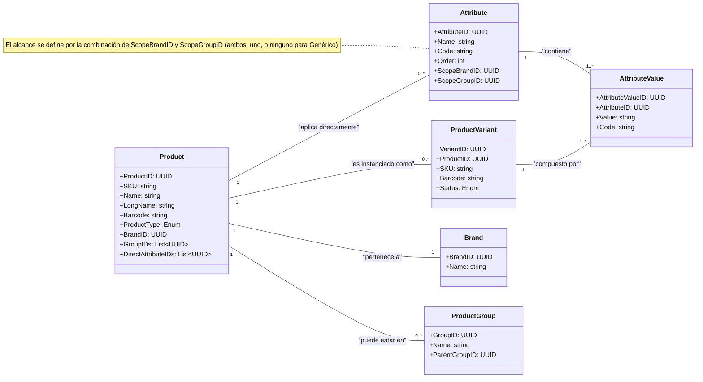

# Diagramas Detallados del Dominio - Módulo Product

- **Version:** 1.1.0
- **Status:** Aceptado

Este documento contiene diagramas explicativos de los conceptos clave en el dominio del módulo `product`.

---

## 1. Diagrama de Clases de Agregados

Este diagrama muestra las entidades principales y sus propiedades, así como las relaciones entre ellas, según el modelo v1.1.



---

## 2. Flujo de Herencia de Atributos (con Anulación)

Este diagrama de actividad ilustra cómo el sistema calcula la lista final de `Attribute`s para un `Product` dado, aplicando la lógica de anulación por `Attribute.Code`.

```mermaid
graph TD
    subgraph "Cálculo de Atributos para un Producto"
        A[Inicio: Se solicita un Producto] --> B{Recolectar todos los Atributos aplicables};
        
        B --> C[Nivel 1: Directos];
        B --> D[Nivel 2: De Grupo + Marca];
        B --> E[Nivel 3: De Grupo];
        B --> F[Nivel 4: De Marca];
        B --> G[Nivel 5: Genéricos];
        
        subgraph "Agrupar y Resolver Anulación"
            H[Agrupar Atributos por 'Attribute.Code']
            I{Para cada 'Code' (ej: "T")}
            J[Buscar atributo 'Directo']
            K[Buscar atributo de 'Grupo+Marca']
            L[Buscar atributo de 'Grupo']
            M[Buscar atributo de 'Marca']
            O[Seleccionar atributo 'Genérico']
            P[Fin para este 'Code']
        end

        subgraph "Resultado"
            Q[Lista final de Atributos únicos por 'Code']
        end

        [C, D, E, F, G] --> H;
        H --> I;
        I --o Tomar el de mayor precedencia --> P;
        P --o Fin de todos los 'Code's --> Q;

    end
```
*Nota: El diagrama ilustra el concepto. La implementación buscaría por `Code` en cada nivel de precedencia, deteniéndose en el primero que encuentre.*

---

## 3. Flujo de Creación Just-in-Time

Este diagrama de secuencia muestra el proceso "Find or Create" cuando se solicita una variante de producto que podría no existir aún en la base de datos.

```mermaid
sequenceDiagram
    participant Actor as "Sistema Externo (ej: Venta)"
    participant ProductService as "Servicio de Producto"
    participant Database as "Base de Datos"

    Actor->>+ProductService: solicitarVariante(ProductID, [AttributeValueID_1, AttributeValueID_2])
    
    ProductService->>+Database: Buscar ProductVariant donde<br/>ProductID=X y AttributeValues=Y
    Database-->>-ProductService: No encontrado
    
    ProductService->>ProductService: Validar que la combinación de<br/>AttributeValues es válida para el Producto
    
    ProductService->>ProductService: Generar SKU jerárquico (ej: 'FYR2040-T.L-C.R')
    
    ProductService->>+Database: INSERT INTO ProductVariant<br/>(..., sku, status='PROVISIONAL')
    Database-->>-ProductService: Nuevo ProductVariant con ID=123
    
    ProductService-->>-Actor: Devolver ProductVariant (ID=123)
```
---
