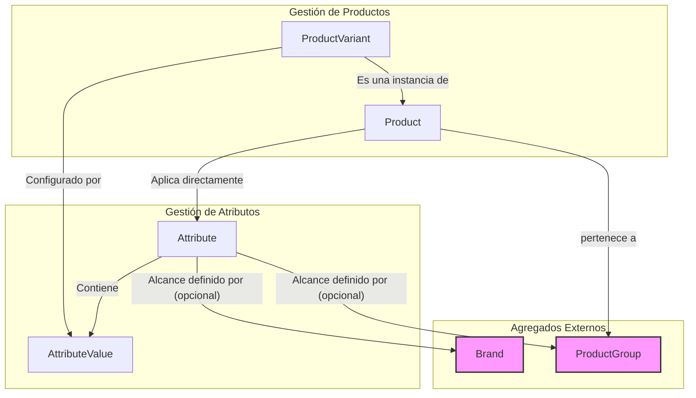

# Product Module: Domain Model

- **Version:** 1.2.0
- **Status:** Implementado (MVP parcial)

Este documento define el modelo de dominio para el módulo de `product`, basado en los requisitos iniciales y las decisiones tomadas en el [ADR-013](./../../architecture/adrs/ADR-013-manejo-de-modificaciones-de-producto.md). Esta versión incorpora un modelo de Atributos/Valores con SKUs jerárquicos.

---

## Estado de Implementación

### ✅ Componentes Implementados (MVP)

1. **Agregado Attribute (CRUD Completo)**
   - Entidades `Attribute` y `AttributeValue` completamente funcionales
   - Operaciones: Crear, Leer, Actualizar, Listar atributos
   - API REST: `GET /api/attributes`, `POST /api/attributes`, `PUT /api/attributes/:id`, `GET /api/attributes/:id`
   - UI funcional: Formulario de creación/edición, lista de atributos
   - Soporte completo para UTF-8 (caracteres españoles: ñ, á, é, etc.)
   - DTOs retornan estructura completa de `AttributeValue` incluyendo ID para operaciones de edición

2. **Entidades Base**
   - `Brand`: Modelo de datos y estructura básica definida
   - `ProductGroup`: Modelo de datos y estructura básica definida

### 🚧 Simplificaciones del MVP vs Diseño Completo

1. **Scopes de Atributos**: La implementación actual **no incluye** la lógica completa de herencia y anulación de atributos por Brand/ProductGroup. Los atributos son actualmente **genéricos** (sin scope específico).

2. **Campos de Auditoría**: Los campos `CreatedBy` y `ModifiedBy` descritos en el diseño original fueron **removidos** del modelo de datos actual. Solo se mantienen timestamps automáticos (`CreatedAt`, `UpdatedAt`).

3. **Agregados Product y ProductVariant**: Aún **no implementados**. La lógica de construcción de SKUs jerárquicos y creación JIT de variantes está pendiente.

### 📋 Pendiente

- Implementación del Agregado `Product`
- Implementación del Agregado `ProductVariant`
- Lógica de herencia de atributos con scopes (Brand, ProductGroup, combinados)
- Construcción automática de SKUs jerárquicos
- Creación Just-in-Time de variantes
- Validación de configuraciones de variantes

---

## 1. Agregados y Entidades

### 1.1. `Attribute` (Aggregate Root)

Gestiona una característica configurable de un producto (ej. "Talla", "Color") y sus posibles valores. Cada atributo y valor tiene un código para la composición de SKUs.

- **Attribute:**
  - `AttributeID` (ID único)
  - `Name` (Nombre descriptivo, ej: "Talla", "Color")
  - `Code` (Código para SKU, ej: "T", "C")
  - `Order` (Entero para ordenar los atributos)
  - `Values` (Lista de `AttributeValue`)

- **AttributeValue (Entity):**
  - `AttributeValueID` (ID único)
  - `Value` (Valor descriptivo, ej: "Large", "Rojo")
  - `Code` (Código para SKU, ej: "L", "R")

### 1.2. `Product` (Aggregate Root)

Representa la plantilla o el concepto general de un artículo o servicio. Las opciones que se le pueden aplicar se determinan por una combinación de herencia y asignación directa de `Attribute`s.

- **Product:**
  - `ProductID` (ID único)
  - `SKU` (SKU base, ej: "FYR2040")
  - `Barcode` (Opcional, EAN/UPC, para productos sin variantes)
  - `Name` (Nombre corto para tickets/listas, ej: "Camiseta Clásica")
  - `LongName` (Nombre completo para facturas/presupuestos, ej: "Camiseta Clásica de Algodón Orgánico")
  - `Description`
  - `ProductType` (Enum: `TANGIBLE`, `SERVICE`)
  - `BrandID` (FK a Brand)
  - `GroupIDs` (Lista de `GroupID`)
  - `DirectAttributeIDs` (Lista de `AttributeID`): Atributos específicos para este producto.
  - `IsActive` (Boolean)

### 1.3. `ProductVariant` (Entity)

La **instancia final y vendible** de un `Product`. Cada `ProductVariant` es una combinación única de `AttributeValue`s de los `Attribute`s aplicables.

- **ProductVariant:**
  - `VariantID` (ID único)
  - `ProductID` (FK a Product)
  - `SKU` (SKU compuesto, ej: `FYR2040-T.L-C.R`)
  - `Barcode` (Opcional, EAN/UPC, para la variante específica)
  - `AttributeValues` (Lista de `AttributeValueID`): Describe la combinación específica.
  - `Status` (Enum: `PROVISIONAL`, `CONFIRMED`)
  - `IsActive` (Boolean)

### 1.4. `Brand` (Aggregate Root)

Agrupa productos bajo una marca común. Es clave para el pricing y el alcance de los `Attribute`s.

- **Brand:**
  - `BrandID` (ID único)
  - `Name`
  - `IsActive` (Boolean)

### 1.5. `ProductGroup` (Aggregate Root)

Categoría jerárquica para productos. Se puede usar para definir el alcance de los `Attribute`s.

- **ProductGroup:**
  - `GroupID` (ID único)
  - `Name`
  - `ParentGroupID` (Opcional)
  - `IsActive` (Boolean)

---

## 2. Diagrama Conceptual

---

## 3. Reglas de Dominio Clave

### Construcción de SKU Jerárquico

El `SKU` de una `ProductVariant` se construye de forma determinista para reflejar su configuración exacta.

- **Fórmula:** `{Product.SKU}-{Attr1.Code}.{Val1.Code}-{Attr2.Code}.{Val2.Code}...`
- **Ejemplo:**
  - `Product.SKU`: "FYR2040"
  - `Attribute` "Talla": `Code` "T"
    - `AttributeValue` "Large": `Code` "L"
  - `Attribute` "Color": `Code` "C"
    - `AttributeValue` "Rojo": `Code` "R"
  - **`ProductVariant.SKU` resultante:** `FYR2040-T.L-C.R`

Los segmentos de atributos en el SKU deben ordenarse de forma consistente según el campo `Attribute.Order`.

### Herencia de Atributos (con Anulación)

El conjunto final de `Attribute`s para un producto se determina mediante una **fusión con anulación por especificidad**. El mecanismo de anulación se basa en el `Attribute.Code`.

El proceso es el siguiente:
1.  Se recolectan todos los `Attribute`s aplicables al producto desde todos los niveles de alcance posibles.
2.  Se agrupan los `Attribute`s recolectados por su `Attribute.Code`.
3.  Para cada grupo (para cada `Code`), se selecciona **un único `Attribute`** siguiendo este estricto orden de precedencia (del más específico al más general):
    1.  **Directo:** Un `Attribute` asignado directamente al producto.
    2.  **Grupo + Marca:** Un `Attribute` cuyo alcance (`Scope`) apunte **simultáneamente** a la `BrandID` y a uno de los `GroupIDs` del producto.
    3.  **Grupo de Producto:** Un `Attribute` cuyo alcance (`Scope`) apunte solo a uno de los `GroupIDs` del producto.
    4.  **Marca:** Un `Attribute` cuyo alcance (`Scope`) apunte solo a la `BrandID` del producto.
    5.  **Genérico:** Un `Attribute` de alcance genérico (sin `BrandID` ni `GroupID`).

El resultado es la lista final y sin solapamientos de `Attribute`s que se usarán para generar las `ProductVariant`. La estructura del `Attribute` debe permitir un alcance combinado de `BrandID` y `GroupID` para soportar esta lógica.

### Creación de Variantes Just-in-Time

Para evitar la pre-generación masiva de `ProductVariant`, el sistema operará bajo un principio de creación "Just-in-Time".

-   **Mecanismo ('Find or Create'):**
    1.  Cuando se solicita una `ProductVariant` específica (ej: al añadir a una orden de venta), el sistema intenta encontrar una variante existente que coincida.
    2.  **Si se encuentra:** Se utiliza la variante existente.
    3.  **Si no se encuentra:** El sistema **crea y persiste** la `ProductVariant` en ese instante. Esta variante se creará con `Status = PROVISIONAL`.
-   **Estados:**
    -   Las variantes creadas vía JIT comienzan con `Status = PROVISIONAL`.
    -   Las variantes creadas manualmente por un usuario o las `PROVISIONAL` que han sido validadas/modificadas pasan a `Status = CONFIRMED`.
