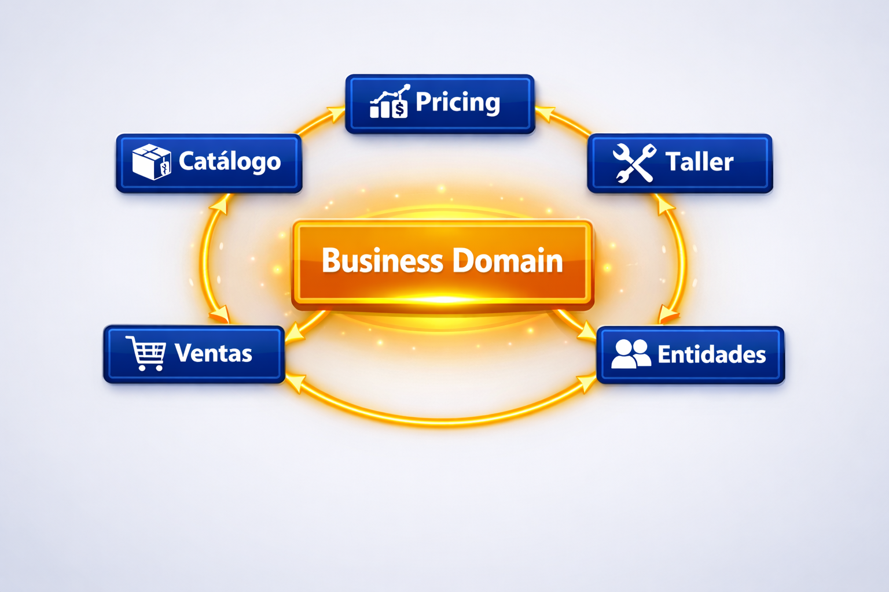
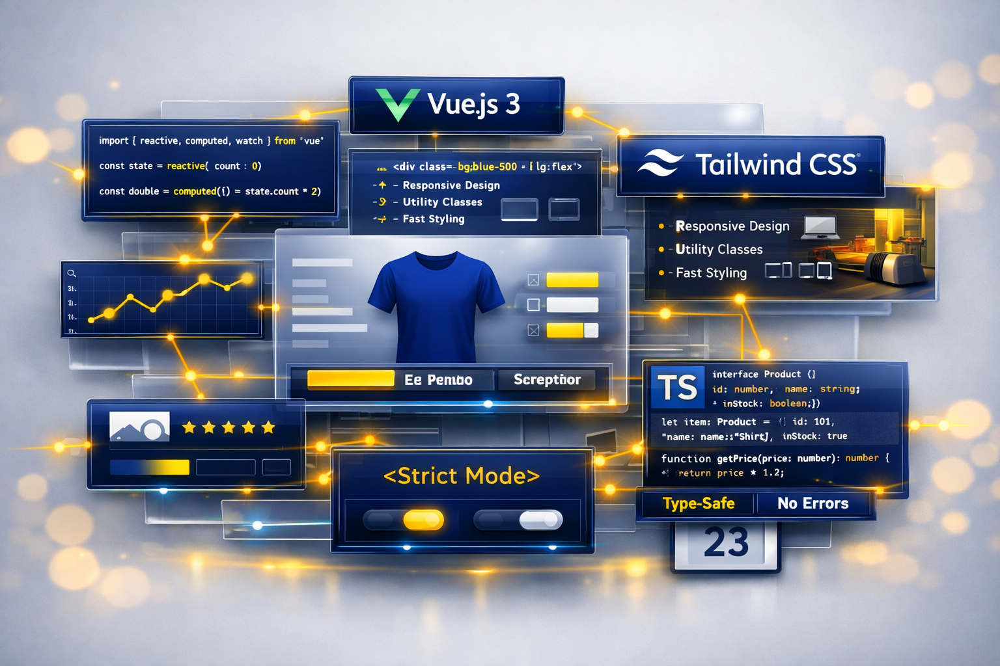

<!-- _class: bg-primary -->
<!-- _header: "" -->
<!-- _footer: "" -->

# TramaTex
### La herramienta de gestión diseñada para la microempresa de textil laboral y EPIs

- **Gestión Completa:** Ventas, producción y personalización textil en una sola plataforma open source.
- **Sector Textil y EPIs:** Diseñado para vestuario laboral, calzado y equipos de protección individual.
- **Control Total de Datos:** Arquitectura local-first: sin dependencias en la nube ni costes recurrentes.

---

# 🚀 Visión y Alcance

## Innovación en el Sector Textil

- **Visión:** Sistema de gestión especializado para PYMES de vestuario laboral y EPIs.
- **Especialización:** Personalización y marcación de prendas.

**El Desafío:** Superar la ineficiencia de procesos manuales y sistemas genéricos costosos mediante una arquitectura `local-first` eficiente.

**Objetivo:** Integrar ventas, tarificación inteligente y producción (MES) en un flujo único.

---

# 📊 Dashboard Principal

## Gestión Centralizada

- Interfaz moderna y minimalista.
- Acceso instantáneo a métricas críticas.
- Diseñado para la agilidad operativa.

**Valor Añadido:**
Módulos de Clientes, Catálogo, Ventas y Producción a un solo click de distancia.

---

# 👥 Módulo Party

## Gestión de Terceros: Enfoque Unificado

- **Entidad Única:** Clientes y proveedores bajo el concepto de `Party`.
- **Roles Dinámicos:** Sin duplicidad de datos; una entidad puede ser ambos.
- **Perfiles:** Soporte para empresas (Organizaciones) y Personas.
- **Relaciones:** Múltiples direcciones y puntos de contacto asociados a un mismo tercero.

Beneficio: Consistencia total en el histórico de transacciones.

---

# 👕 Módulo Product

## Catálogo Inteligente y Variantes Dinámicas

- **Configurabilidad:** Atributos flexibles (tallas, colores, materiales).
- **Variantes JIT:** Creación automática según demanda (Just-In-Time).
- **Organización:** Clasificación por marcas, familias y grupos.
- **Precisión:** Base sólida para cálculo de costes y producción.

Manejo sencillo de catálogos complejos de alta rotación sin carga manual masiva.

---

# 💰 Módulo Sales

## Del Presupuesto a la Factura: Ciclo Total

- **Ciclo de Vida:** Cotizaciones → Pedidos → Albaranes → Facturas.
- **Trazabilidad:** Transiciones automáticas manteniendo el rastro.
- **Flexibilidad:** Soporte para tickets retail y facturación simplificada.
- **Control de Precios:** Motor inteligente con ajustes supervisados.

Resultado: Cero errores en facturación y visión clara de cada pedido.

---

# 🏭 Módulo MES

## Taller y Producción: El Corazón Operativo

- **Órdenes de Producción:** Transformación automática desde pedidos de venta.
- **Monitorización:** Seguimiento en tiempo real en centros de trabajo.
- **Calidad:** Registro de verificaciones en cada etapa.
- **Sincronización:** Conexión directa oficina-taller.

Optimización de tiempos de entrega y reducción de errores en personalizaciones.

---

# 🗓️ Hitos y Futuro

## Realidad Actual y Evolución

### ✅ MVP (Completado)
- Core: Clientes, Productos, Precios.
- Ventas y Gestión de Taller (MES).
- Seguridad y accesos robustos.

### 🚀 Hoja de Ruta
- **BI:** Cuadros de mando avanzados.
- **Notificaciones:** WebSockets en tiempo real.
- **Expansión:** Compras, Logística y Contabilidad.

---

# 🛠️ Ingeniería Sólida y Escalable

## Base técnica pensada para mantener y evolucionar el producto

- **Arquitectura Modular:** Dominios independientes que favorecen estabilidad y crecimiento.
- **Clean Architecture:** Lógica de negocio protegida frente a cambios tecnológicos.
- **Domain-Driven Design:** El software habla el lenguaje real del negocio textil.

Base técnica preparada para crecer sin perder mantenibilidad.

**Visual:** 

---

# ⚡ El Corazón Tecnológico (Go)

## Backend: Potencia y Eficiencia

# Go
PostgreSQL
 

- **Alto Rendimiento:** Procesamiento ultra-rápido.
- **Estabilidad:** Binario único, arranque instantáneo.
- **Concurrencia:** Gestión nativa de procesos simultáneos.
- **Integridad:** Seguridad total de la información financiera.

---

# 🎨 Experiencia de Usuario (Vue.js)

## Frontend: Agilidad y Modernidad

- **Tecnología:** Vue.js 3 + TypeScript + Vanilla CSS.
- **Interactividad:** Interfaz reactiva para mayor productividad.
- **Consistencia:** Sistema de diseño unificado (Design System).
- **Adaptabilidad:** Estaciones de trabajo y terminales de taller.

Calidad: Tipado estricto que elimina errores de interfaz.

**Visual:** 

---

# 📦 Simplicidad y Despliegue

## Filosofía Local-First

- **Independencia:** Operación 100% local (privacidad y sin internet).
- **Eficiencia:** Optimizado para hardware modesto.

### Facilidad de Gestión:
- **Docker:** Despliegue estandarizado y actualizaciones sin fricción.
- **Mantenimiento:** Diseñado para mínima intervención técnica.

---

# 🏗️ Scaffolding

## Un proyecto derivado de TramaTex para arrancar desarrollos con IA

- **Nacido de TramaTex:** Captura decisiones reales del proyecto, su estructura modular y criterios de calidad.
- **Guía de Desarrollo con IA:** Usa agentes y contexto estructurado para reducir ambigüedad en tareas técnicas.
- **Reutilización Acelerada:** Incluye bootstrap y plantillas para iniciar proyectos con consistencia desde el primer día.

**Visual:** 

---

<!-- _class: bg-primary -->
<!-- _header: "" -->
<!-- _footer: "" -->

# TramaTex
## Preparados para el Siguiente Nivel

- Solución ERP/MES específica para el sector textil.
- Arquitectura moderna, estable y escalable.
- Disciplina de ingeniería para un producto de alto rendimiento.

### **¡Gracias por su atención!**

TramaTex: El aliado tecnológico definitivo.

